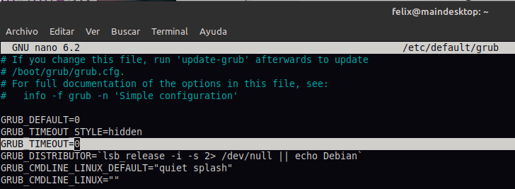
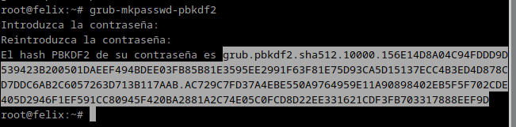

author: Félix Saánchez González
summary: Proyecto sobre hardened de arranque de Linux
id: 12
categories: codelab,markdown
environments: Linux
status: Published
feedback link: https://github.com/V0id-array/Bastionado_Proyecto-1.2/issues
# Hardening del arranque de Linux y GRUB

## Introducción


El proceso de arranque de un sistema operativo Linux, como se ilustra en el diagrama, es una secuencia ordenada de eventos que inicia con el encendido del equipo y culmina con la carga completa del sistema operativo

1. **Encendido y POST:** Al encender el equipo, el BIOS o UEFI (Firmware de la placa base) realiza una serie de autocomprobaciones (POST) para verificar que el hardware funcione correctamente.
2. **Dispositivo de arranque:** Una vez superado el POST, el sistema busca el dispositivo de arranque configurado (generalmente un disco duro o una unidad USB) y carga el primer sector de este dispositivo.
3. **Cargador de arranque (GRUB2):** Este sector contiene el cargador de arranque, típicamente GRUB2. GRUB2 es un programa pequeño y potente que permite al usuario seleccionar el sistema operativo a cargar y proporciona opciones de configuración adicionales.
4. **Kernel:** Tras seleccionar una opción de arranque, GRUB2 carga el kernel de Linux en la memoria. El kernel es el núcleo del sistema operativo y se encarga de gestionar los recursos del hardware y de iniciar los procesos necesarios para el funcionamiento del sistema.
5. **Iniciación del sistema:** Una vez cargado el kernel, se inicia el proceso de inicialización del sistema, que puede seguir diferentes modelos (niveles de ejecución o systemd).

GRUB2 tiene un papel importante en este proceso, ya que actúa como una puerta de entrada al sistema operativo. Al controlar qué kernel se carga y con qué parámetros, comprometer GRUB2 significaría llegar a tener control total del sistema. Un atacante que logre comprometer GRUB2 puede modificar el proceso de inicio, instalar software malicioso, ejecutar codigo con privilegios de administrador o acceder a los datos de los discos duros. 

Para esta práctica se utilizará una máquina virtual en VirtualBox con Debian 12.


## **Ocultación del arranque**

Para esto se ha editado el archivo /etc/default/grub

`GRUB_TIMEOUT_STYLE=menu`  a `GRUB_TIMEOUT_STYLE=hidden`  y 

`GRUB_TIMEOUT=5` a `GRUB_TIMEOUT=0` 



Para aplicar los cambios:

```bash
$ sudo update-grub
```

Tras estos cambios, al reiniciar no debería aparecer el menú del GRUB sino que directamente cargaría el sistema operativo.

## **Contraseña de arranque**

fuente: [https://linuxconfig.org/set-boot-password-with-grub](https://linuxconfig.org/set-boot-password-with-grub)

El primer paso es generar un hash de la contraseña utilizando un comando específico. Esto evita que la contraseña sea visible si alguien llegara a acceder al archivo de configuración de GRUB. 



Para introducirla, se abre el siguiente archivo de configuración de GRUB:

```bash
$ sudo nano /etc/grub.d/00_header
```

Y se añaden las siguientes lineas al final, cambiar los campos `USUARIO` por el nombre de usuario que se desee e `INSERT-HASH` por el creado en el paso anterior.

```bash
cat << EOF
set superusers="USUARIO"
password_pbkdf2 USUARIO INSERT-HASH
EOF
```

para guardar cambios en el editor nano, pulsar “Control” + “o” y salir con “Control” + “x”


Para aplicar los cambios se tiene que ejecutar un `update-grub` y probarse reiniciando el equipo
 

```bash
$ sudo update-grub
$ sudo reboot 
```

Resultado:


## **Copia de seguridad**

fuente: [https://wiki.archlinux.org/title/GRUB/Tips_and_tricks](https://wiki.archlinux.org/title/GRUB/Tips_and_tricks)

Para esta practica los he copiado simplemente con el comando `cp`

Los archivos de configuración del GRUB se pueden copiar con los siguientes comandos (editar los PATH a los convenientes) :

```bash
sudo cp /etc/default/grub /path/to/backup/
sudo cp -r /etc/grub.d /path/to/backup/
sudo cp /boot/grub/grub.cfg /path/to/backup/
sudo cp /boot/grub/custom.cfg /path/to/backup
```

Para restaurar la configuración se tendría que copiar los archivos desde donde se hayan guardado y sustituir los que tenga el GRUB actualmente:

```bash
sudo cp /path/to/backup/ /etc/default/grub
sudo cp -r /path/to/backup/ /etc/grub.d 
sudo cp /path/to/backup/ /boot/grub/grub.cfg
sudo cp /path/to/backup /boot/grub/custom.cfg
```

Por último aplicar los cambios actualizando el GRUB con: 

```bash
$ sudo update-grub
```

## **Otras opciones de seguridad**

fuente: [https://soloconlinux.org.es/securizando-grub/](https://soloconlinux.org.es/securizando-grub/)

Otras medidas de seguridad para proteger el arranque pueden incluir encriptar las particiones del disco y modificar los parámetros del kernel. A continuación se explica de manera básica ambos procesos.

### **Encriptar los discos duros con LUKS**

Es necesario tener instalado cryptsetup. Se puede instalar con el siguiente comando en sistemas Debian/Ubuntu:

```bash
sudo apt install cryptsetup
```

Se requiere una partición vacía para la encriptación. Por ejemplo, se asume que la partición a encriptar es /dev/sdb2.

Para encriptar la partición, se ejecuta el siguiente comando:

```bash
sudo cryptsetup luksFormat /dev/sdb2
```

Se debe introducir una contraseña para proteger la partición.

Para acceder a la partición encriptada, se utiliza el siguiente comando:

```bash
sudo cryptsetup luksOpen /dev/sdb2 nombreParticion
```

Después de abrir la partición, es necesario formatearla con un sistema de archivos. Para formatearla como ext4:

```bash
sudo mkfs.ext4 /dev/mapper/nombreParticion
```

Se crea un punto de montaje y se monta la partición:

```bash
mkdir /mnt/particionsecreta
sudo mount /dev/mapper/nombreParticion /mnt/particionsecreta
```

El estado de la partición encriptada se puede verificar con el siguiente comando:

```bash
sudo cryptsetup -v status nombreParticion
```

Para desmontar y cerrar el volumen:

```bash
sudo umount /mnt/particionsecreta
sudo cryptsetup luksClose nombreParticion
```

Para montar la partición automáticamente al inicio, es necesario editar los archivos /etc/crypttab y /etc/fstab.

```bash
sudo nano /etc/crypttab
```

Se agrega la siguiente línea:

```
nombreParticion /dev/sdb2 none luks
```

```bash
sudo nano /etc/fstab
```

Se agrega la siguiente línea:

```
/dev/mapper/nombreParticion /mnt/particionsecreta ext4 defaults 0 2
```

Con esta configuración, se solicitará la contraseña para desbloquear la partición en cada inicio del sistema.

## Activar opciones del kernel al arranque:

Estas se pueden activar desde los parámetros de GRUB en el siguiente fichero `/etc/default/grub`

`GRUB_CMDLINE_LINUX_DEFAULT="quiet splash kaslr"`

Estas son algunas de las opciones que pueden mejorar las seguridad del sistema en el aranque:

- **CONFIG_DEBUG_SG=y**, **CONFIG_DEBUG_NOTIFIERS=y**, **CONFIG_DEBUG_CREDENTIALS=y**, **CONFIG_DEBUG_LIST=y**, **CONFIG_BUG_ON_DATA_CORRUPTION=y**, **CONFIG_SCHED_STACK_END_CHECK=y**: Estas configuraciones activan la validación de estructuras frecuentemente atacadas, como tablas SG, cadenas de llamadas de notificación, gestión de credenciales y manipulación de listas enlazadas.
- **CONFIG_DEBUG_VIRTUAL=y**: Activa verificaciones de integridad en el código que convierte direcciones virtuales a físicas, ayudando a prevenir ciertas corrupciones de datos.
- **CONFIG_INTEL_IOMMU_DEFAULT_ON=y**: Activa el IOMMU por defecto para proteger contra ataques DMA (Acceso Directo a Memoria).
- **CONFIG_GCC_PLUGIN_STRUCTLEAK=y**: Inicializa automáticamente las variables de pila a cero, mitigando vulnerabilidades relacionadas con memoria no inicializada. Utiliza la opción más robusta de STRUCTLEAK (BYREF_ALL).
- **CONFIG_GCC_PLUGIN_RANDSTRUCT=y**: Aleatoriza la disposición de las estructuras sensibles del kernel. No se debilita esta función con la opción RANDSTRUCT_PERFORMANCE.
- **CONFIG_GCC_PLUGIN_LATENT_ENTROPY=y**: Permite recopilar más entropía durante el arranque.
- **CONFIG_RESET_ATTACK_MITIGATION=y**: Previene ataques de arranque en frío sobrescribiendo la memoria con ceros al apagarse. Requiere soporte del firmware.
- **CONFIG_CRYPTO_JITTERENTROPY=y**, **CONFIG_HW_RANDOM_INTEL=y**, **CONFIG_HW_RANDOM_AMD=y**, etc.: Integran Jitterentropy y varios generadores de números aleatorios basados en hardware (HWRNG) para mejorar la entropía.
- **CONFIG_MODULE_SIG_ALL=y**, **CONFIG_MODULE_SIG_HASH="sha512"**: Firma todos los módulos del kernel durante la compilación usando SHA512, la función hash más robusta disponible. La verificación de firmas aún no se aplica.
- **CONFIG_PANIC_ON_OOPS=y**: Provoca que el kernel entre en pánico ante errores "oops", frustrando ciertos tipos de exploits. Solo se habilita para el kernel endurecido (hardened-vm-kernel) debido a posibles problemas en algunas máquinas host. Se recomienda que los hosts activen esta característica mediante el paquete `security-misc`.
- **CONFIG_MAGIC_SYSRQ_DEFAULT_ENABLE=0x84**: Limita la tecla SysRq para permitir únicamente las funciones SAK (Secure Attention Key) y apagados.

Para aplicar los cambios:

```bash
$ sudo update-grub
```

En el enlace de la fuente se pueden encontrar más opciones con las que para customizar el kernel o descargarnos. [https://www.kicksecure.com/wiki/Hardened-kernel](https://www.kicksecure.com/wiki/Hardened-kernel) 

También podemos descargarnos la configuración del proyecto [hardened-kernel](https://www.kicksecure.com/wiki/Download)

## Conclusión 
El hardening en Linux es un proceso continuo que requiere atención y adaptación a medida que surgen nuevas amenazas. Implementar las mejores prácticas descritas no solo ayuda a proteger el sistema contra ataques, sino que también contribuye al cumplimiento de normativas y estándares de seguridad. Al adoptar un enfoque proactivo hacia la seguridad, los administradores pueden garantizar que sus sistemas Linux operen en un entorno seguro y resiliente. 